# Mini PayPay Rewards App Infrastructure

## Table of Contents

[1. App Description](#1-app-description--)<br>
[2. System Architecture](#2-system-architecture--)<br>
[3. Consumed Technologies, Tools and Dependencies](#3-consumed-technologies-tools-and-dependencies--)<br>
[4. Installation](#4-installation--)<br>
&nbsp;&nbsp;&nbsp;&nbsp;[4.1. Run Database (Postgres)](#41-run-database-postgres--)<br>
&nbsp;&nbsp;&nbsp;&nbsp;[4.2. Run Backend App](#42-run-backend-app--)<br>
&nbsp;&nbsp;&nbsp;&nbsp;[4.3. Run React Native (Expo) App](#43-run-react-native-expo-app--)<br>
&nbsp;&nbsp;&nbsp;&nbsp;[4.4. Notes](#44-notes)<br>
&nbsp;&nbsp;&nbsp;&nbsp;&nbsp;&nbsp;&nbsp;&nbsp;[4.4.1. Push notifications doesn't work on Android Expo Go](#441-push-notifications-doesnt-work-on-android-expo-go--)<br>
&nbsp;&nbsp;&nbsp;&nbsp;&nbsp;&nbsp;&nbsp;&nbsp;[4.4.2. Backend tests](#442-backend-tests--)<br>
[5. Demo Account Credentials](#5-demo-account-credentials)<br>
[6. Managing the Source Code](#6-managing-the-source-code--)<br>
&nbsp;&nbsp;&nbsp;&nbsp;[6.1. Client-side app (React Native (Expo) App)](#61-client-side-app-react-native-expo-app)<br>
&nbsp;&nbsp;&nbsp;&nbsp;[6.2. Server-side app (Express) (Node)](#62-server-side-app-express-node)<br>
&nbsp;&nbsp;&nbsp;&nbsp;[6.3. Database structure (Postgres)](#63-database-structure-postgres)<br>
[7. Usage](#7-usage--)<br>
&nbsp;&nbsp;&nbsp;&nbsp;[7.1. Functional features of the App](#71-functional-features-of-the-app--)<br>
&nbsp;&nbsp;&nbsp;&nbsp;[7.2. Non-functional features of the App](#72-non-functional-features-of-the-app--)<br>
&nbsp;&nbsp;&nbsp;&nbsp;[7.3. Walkthrough of the Mini PayPay Rewards App](#73-walkthrough-of-the-mini-paypay-rewards-app--)<br>
&nbsp;&nbsp;&nbsp;&nbsp;&nbsp;&nbsp;&nbsp;&nbsp;[7.3.1. Screenshots on iOS](#731-screenshots-on-ios-)<br>
&nbsp;&nbsp;&nbsp;&nbsp;&nbsp;&nbsp;&nbsp;&nbsp;[7.3.2. Screen recording on iOS](#732-screen-recording-on-ios-)<br>
&nbsp;&nbsp;&nbsp;&nbsp;&nbsp;&nbsp;&nbsp;&nbsp;[7.3.3. Screenshots on Android](#733-screenshots-on-android-)<br>
&nbsp;&nbsp;&nbsp;&nbsp;&nbsp;&nbsp;&nbsp;&nbsp;[7.3.4. Screen recording on Android](#734-screen-recording-on-android-)<br>
&nbsp;&nbsp;&nbsp;&nbsp;[7.4. API Documentation](#74-api-documentation--)<br>
[8. Possible Infrastructure Improvements](#8-possible-infrastructure-improvements)<br>
[9. Credits](#9-credits--)<br>
[10. License](#10-license--)<br>

## Documentation

### 1. App Description -
**Mini PayPay Rewards App** is a 3-tier mobile rewards application that lets a signed-in user track a points balance, browse a rewards catalogue, and redeem rewards in exchange for points. The system is split across a React Native (Expo) mobile client, an Express + Prisma REST API, and a PostgreSQL database, plus an outbound integration with the Expo Push Notification service.<br/>

There are three primary screens in the mobile app, guarded behind authentication:

1. **Home** —<br>
Shows the user's current point balance ("Vault Points Available") and a five-row Activity Log preview of the most recent ledger entries. A "Redeem Now" button jumps straight to the Rewards tab and the "VIEW ALL" button opens the History tab.
2. **History** —<br>
A paginated transaction ledger (default 20 per page, with infinite scroll,  fetching the next 20 once the user reaches the bottom). With pull-to-refresh re-fetches the user's balance and the latest transactions.
3. **Rewards** —<br>
The redeemable catalogue. Each card shows the reward image, stock state (`IN STOCK`, `X LEFT`, `SOLD OUT`), points cost, and a state-aware buttons (`Claim Now`, `Locked` with an "Insufficient Points" overlay, `Notify Me` when sold out).<br>
Tapping `Claim Now` opens a confirmation bottom sheet that walks through `confirm => loading => success / error` states. If the request is success, the API updates the user's balance, transaction history, and reward stock without a page reload, and a confirmation push notification is requested via Expo.

Other features include:<br>
- Secure JWT storage with proactive refresh
- An offline banner controlled by NetInfo
- A global "you're offline" alert routed through a Redux UI slice
- Animated count-down on the rewards balance
- Haptic feedback on auth events (login, logout)
- Skeleton placeholders during initial data loads

<hr>

### 2. System Architecture -
<p align="center">
  <kbd>
    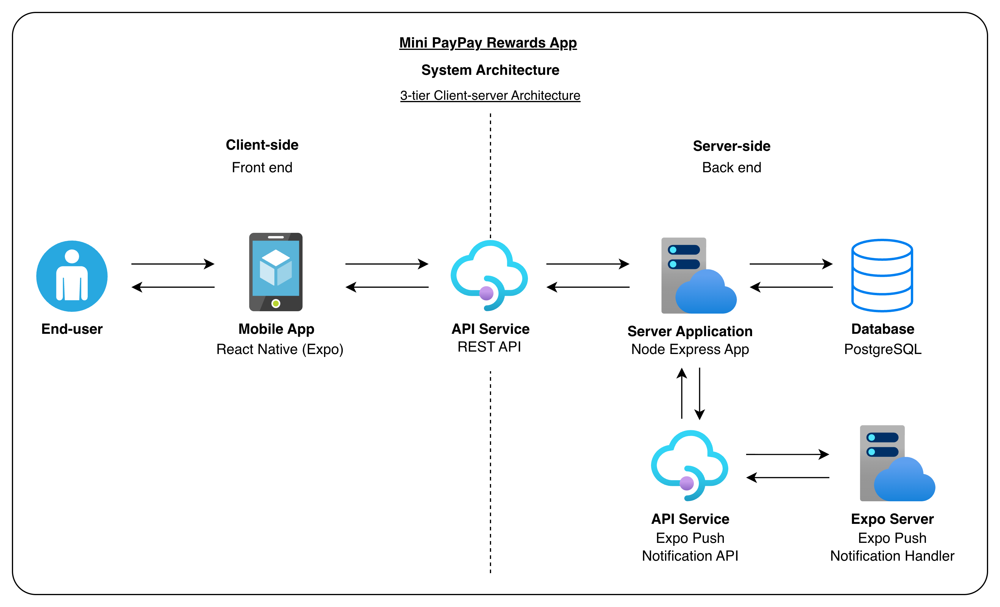
  </kbd>
</p>
<p align="center">Figure 2.1: System Architecture Diagram</p>

This system uses a **3-tier client-server architecture** — presentation layer (mobile app), application logic layer (Express REST API), and data layer (PostgreSQL) — with JWT-authenticated HTTPS between the client and the API. Push notification delivery is handled to Expo's hosted notification service.

**How data flows, end to end**

Every meaningful action — logging in, opening the History tab, redeeming a reward — follows the same round-trip, just with different cargo:

1. **User interacts -**<br>
- User engages with the app and the app captures the action. This is stored in the local store.
2. **App calls the backend -**<br>
- A HTTPS client attaches the user's stored JWT and sends the requests to the backend.<br>
- If the token is within two minutes of expiring, it's refreshed beforehand.<br>
- If the device is offline the request doesn't go out, causing the offline banner to be visible on the UI and also an alert will shown if the user interacts with the app.
3. **Backend checks and executes -**<br>
- The backend app verifies the JWT, validates the body and if authorized, the request is passed to the handle the business logic.
- Sensitive operations like redemptions are handled in the database transaction, to manipulate the user's points and reward's stock.
4. **Database storage -**<br>
- Postgres stores who the user is, every point earned or spend, the reward catalogue, and manipulate record for each redemption.
- Foreign keys keep the four tables consistent, eg: deleting a user will cause their history to be deleted alongside, and it won't be possible to delete a reward someone has already claimed.
5. **Backend Response -**<br>
- API returns JSON and the app forwards it to Redux. The screens that rely on the response will re-render automatically due to the state change.
- After a successful redeem, the balance counts down to it's new value and the History and Rewards lists update. To update the UI, it don't require a manual reload.
6. **One async side trip**<br>
- After the redemption is safely committed, the API will send a request to Expo to trigger a confirmation push notification.

<hr>

### 3. Consumed Technologies, Tools and Dependencies -

* **Languages**
  * TypeScript across mobile app, API, and seed/migration scripts

* **Mobile app — frameworks & runtime**
  * [Expo](https://expo.dev) (SDK 54) on top of [React Native](https://reactnative.dev) 0.81
  * [React](https://react.dev) 19 with [React Hooks](https://react.dev/reference/react)
  * [Expo Router](https://docs.expo.dev/router/introduction/) — file-based navigation with `(auth)` / `(app)` route groups

* **Mobile app — key dependencies**
  * [Redux Toolkit](https://redux-toolkit.js.org) + [`react-redux`](https://react-redux.js.org) — `auth` / `ledger` / `rewards` / `ui` slices
  * [Axios](https://axios-http.com) — REST client with request/response interceptors
  * [`react-hook-form`](https://react-hook-form.com) — login form validation
  * [`expo-secure-store`](https://docs.expo.dev/versions/latest/sdk/securestore/) — JWT + expiry persistence (iOS Keychain / Android Keystore)
  * [`expo-notifications`](https://docs.expo.dev/versions/latest/sdk/notifications/) + [`expo-device`](https://docs.expo.dev/versions/latest/sdk/device/) — push notification registration & handling
  * [`@react-native-community/netinfo`](https://github.com/react-native-netinfo/react-native-netinfo) — offline detection (drives the banner & disabled write actions)
  * [`expo-haptics`](https://docs.expo.dev/versions/latest/sdk/haptics/) — login / logout feedback
  * [`expo-image`](https://docs.expo.dev/versions/latest/sdk/image/) + [`expo-blur`](https://docs.expo.dev/versions/latest/sdk/blur-view/) — reward image caching and modal blur
  * [`@expo/vector-icons`](https://docs.expo.dev/guides/icons/) (Ionicons)
  * [`react-native-safe-area-context`](https://github.com/th3rdwave/react-native-safe-area-context), `react-native-reanimated`, `react-native-gesture-handler`, `react-native-screens`
  * [`base-64`](https://github.com/mathiasbynens/base64) — JWT payload decoding for client-side expiry checks

* **API — frameworks & runtime**
  * [Node](https://nodejs.org) with [Express 5](https://expressjs.com)
  * [Prisma 7](https://www.prisma.io) + [`@prisma/adapter-pg`](https://www.prisma.io/docs/orm/overview/databases/postgresql) + [`pg`](https://node-postgres.com)

* **API — key dependencies**
  * [`jsonwebtoken`](https://github.com/auth0/node-jsonwebtoken) — sign / verify JWTs
  * [`bcryptjs`](https://github.com/dcodeIO/bcrypt.js) — password hashing
  * [`zod`](https://zod.dev) — request body validation
  * [`cors`](https://github.com/expressjs/cors), [`dotenv`](https://github.com/motdotla/dotenv) — middleware & env loading
  * [Expo Push API](https://docs.expo.dev/push-notifications/sending-notifications/) — fired via `fetch()` from the API after a successful redemption

* **Database**
  * [PostgreSQL 16](https://www.postgresql.org) (run locally via [Docker Compose](https://docs.docker.com/compose/))
  * Tables: `users`, `point_ledger`, `rewards`, `redemptions`

* **Dev tooling**
  * [`tsx`](https://github.com/privatenumber/tsx) + [`nodemon`](https://nodemon.io) — API hot reload
  * [Jest](https://jestjs.io) + [`ts-jest`](https://kulshekhar.github.io/ts-jest/) — backend unit tests (redemption service)
  * [ESLint](https://eslint.org) + [`typescript-eslint`](https://typescript-eslint.io) + [Prettier](https://prettier.io)
  * [Visual Studio Code](https://code.visualstudio.com)

<hr>

### 4. Installation -

The repository contains three independent projects under `Workspace/`:

| Folder | What it is |
|---|---|
| `mini-pay-pay-rewards_db-config/` | Docker Compose file that boots PostgreSQL 16 |
| `mini-paypay-rewards_api/` | Express + Prisma REST API |
| `mini-paypay-rewards_app/` | Expo / React Native mobile app |

**Prerequisites** — install these on your machine before you start:
* [Node](https://nodejs.org) 20 or newer (LTS) and `npm`
* [Docker Desktop](https://www.docker.com/products/docker-desktop/)
* [Expo Go](https://expo.dev/client) on a physical iOS or Android device, **or** the iOS Simulator / an Android emulator on your machine

**The database needs to be up before the API and the API needs to be up before the app.**

#### 4.1. Run Database (Postgres) -

```bash
# Ensure docker is running beforehand
cd Workspace/mini-pay-pay-rewards_db
docker compose up -d
```

#### 4.2. Run Backend App -

```bash
cd ../mini-paypay-rewards_api
npm install                           # install dependencies
cp .env.example .env                  # copy environment variables
npx prisma generate                   # generate types Prisma client
npx prisma migrate dev --name init    # apply schema to the running database
npx prisma db seed                    # populate database - insert demo users, rewards, ledger entries
npm run dev                           # API is running and is listening on http://localhost:4000
```

#### 4.3. Run React Native (Expo) App -

```bash
cd ../mini-paypay-rewards_app
npm install                           # install dependencies
npm start
```

##### 4.4. Notes
###### 4.4.1. Push notifications doesn't work on Android Expo Go -<br>
- Expo has removed remote-push support from Android Expo Go in SDK 53.
- Use a [development build](https://docs.expo.dev/develop/development-builds/introduction/) or test on iOS Expo Go.
###### 4.4.2. Backend tests -<br>
- From `mini-paypay-rewards_api/`, run `npm test` to execute the Jest unit tests for the redemption service.

### 5. Demo Account Credentials

| Email | Password |
|---|---|
| `lucas@test.com` | `Testing2$` |
| `sam@test.com` | `Testing3$` |
| `william@test.com` | `Testing4$` |

- Each demo user starts with a balance of **24,850 points** and 25 ledger entries.

<hr>

### 6. Managing the Source Code -
#### 6.1. Client-side app (React Native (Expo) App)
Client-side app's source code is located in the following directory =>
```
  Workspace -> mini-paypay-rewards_app [client]
```
Source code structure =>
<p align="center">
  <kbd>
      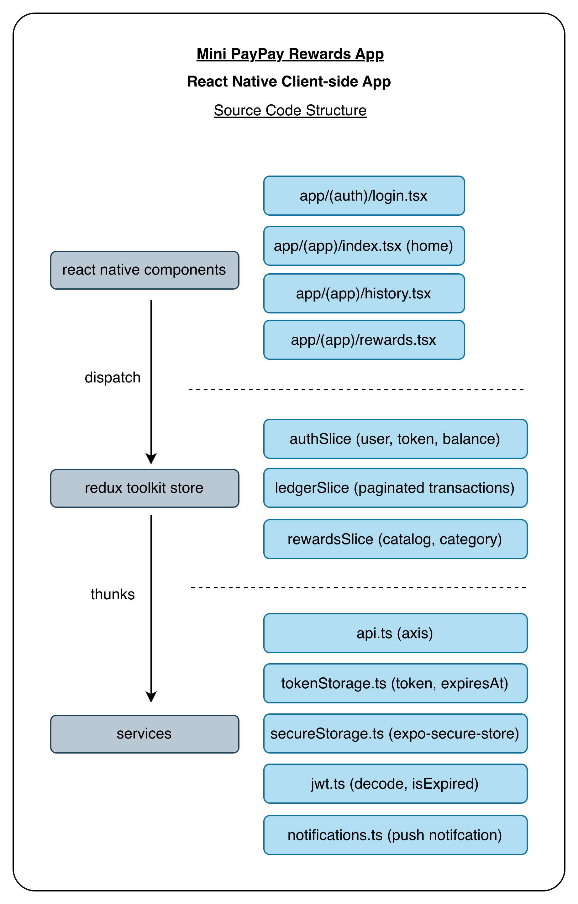
  </kbd>
</p>
<p align="center">Figure 6.1: Client-side app (React Native (Expo)) Source Code Structure</p>

#### 6.2. Server-side app (Express) (Node)

Server-side app's source code is located in the following directory =>
```
  Workspace -> mini-paypay-rewards_api [server]
```
Source code structure =>
<p align="center">
  <kbd>
      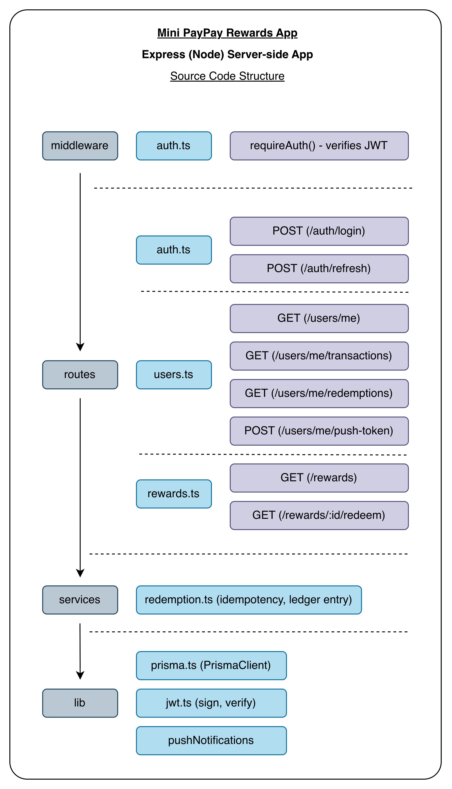
  </kbd>
</p>
<p align="center">Figure 6.2: Server-side app (Express) (Node) Source Code Structure</p>

#### 6.3. Database structure (Postgres)

Database model definitions are located in the following directory =>
```
  Workspace -> mini-paypay-rewards_api/prisma/schema.prisma [db model definitions]
```
Database Schema =>
<p align="center">
  <kbd>
      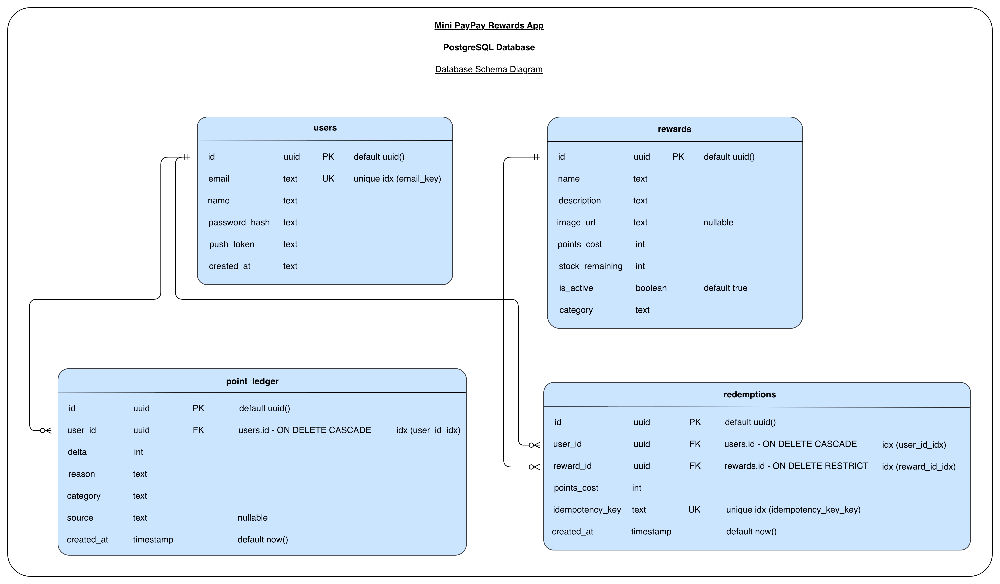
  </kbd>
</p>
<p align="center">Figure 6.3: Database Schema Diagram</p>

<hr>

### 7. Usage -
  #### 7.1. Functional features of the App -
  * **Authentication -**
    * Email + password login access to the backend; the JWT is stored in `expo-secure-store` together with its decoded expiry.
    * Tokens are auto-refreshed when within two minutes of expiring; expired sessions are cleared and the user is directed to the Login screen.
    * Logout clears the token locally and requests the backend to clear the device's push token.
  * **Home screen -**
    * Shows the user's current balance.
    * Renders an Activity Log preview of the five most recent ledger entries.
  * **History screen -**
    * Paginated transaction list (default 20 per page). The next 20 will fetch automatically when the user scrolls to the end.
    * Pull-to-refresh, re-fetches the user's balance and the latest transactions.
  * **Rewards screen -**
    * Catalogue of active rewards with category filter chips (All / Lifestyle / Travel).
    * Each card shows image, name, description, points cost, and a stock badge (`IN STOCK`, `X LEFT`, or `SOLD OUT`).
    * State-aware buttons: `Claim Now`, `Locked` (with an "Insufficient Points" overlay), or `Notify Me` when sold out.
    * Tapping `Claim Now` opens a confirmation bottom sheet that walks through `confirm => loading => success / error` flow.
    * On a successful redeem, the balance, transaction history, and reward stock all update in place without full reload and the balance counts down to its new value.
  * **Push notifications -**
    * The device registers an Expo push token after login and the API stores it on `users.push_token`.
    * The API fires a confirmation notification after a successful reward redeem ("Redemption confirmed — *reward name*").
  * **Offline handling -**
    * NetInfo-driven banner appears at the top of every screen when the device is offline.
    * Write actions (e.g. Claim Now) are disabled while offline.
    * Any request that fails without a response, a global "You're offline" alert modal is shown.
  * **Idempotent redemption -**
    * `POST /rewards/:id/redeem` requires an `X-Idempotency-Key` header, replaying the same key returns the original redemption instead of charging twice.
    * Stock is decremented inside the same transaction, with a conditional `updateMany` that rejects the write if a concurrent request already took the last unit.

  #### 7.2. Non-functional features of the App -

  * **Type safety -**
    * TypeScript across the mobile app, API, Prisma schema, and seed scripts.
  * **Data consistency -**
    * Atomic Prisma `$transaction`s for redemptions; FK cascade rules keep the four tables coherent.
  * **Resilience -**
    * JWT refresh skew, secure on-device token storage, offline detection + global alert, idempotency keys to make retries safe.
  * **Modularity -**
    * Clean separation of UI / hooks / Redux slices / services on the client, and middleware / routes  / services / lib on the server.
    * Generic `ConfirmationModal` and `AlertModal` components are reused across flows.
  * **Performance -**
    * Image caching via `expo-image`, native-driver animations (count-down balance, three-dots loader, skeletons), single-flight token refresh, and parallel `refreshMe + fetchLedger` after redemption.
  * **Testability -**
    * Backend redemption logic extracted into a pure service so it can be unit-tested with a mocked Prisma client (Jest + ts-jest).
  * **Code quality -**
    * ESLint + `typescript-eslint` + Prettier configured on both projects.
    * Consistent naming for slices, thunks, and routes.
  * **Accessibility -**
    * Uses `react-native-safe-area-context` to respect device notches and home indicators.
    * Large react native hit slops on icon buttons to increase the tappable area.
    * Haptic feedback on auth events.
  * **Observability -**
    * Failed background actions (e.g. clearing the push token on logout) are logged with `console.error` so they're visible in the Metro logs without breaking the user flow.

  #### 7.3. Walkthrough of the Mini PayPay Rewards App -
  ##### 7.3.1. Screenshots on iOS =>
  <p align="center">
    <kbd>
        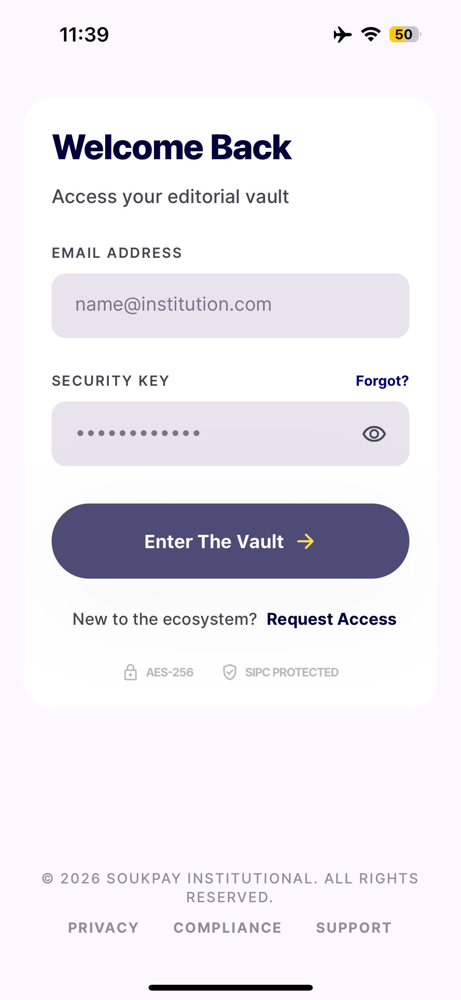
    </kbd>
  </p>
  <p align="center">Figure 7.3.1.1: Login screen - Initial state</p>

  <p align="center">
    <kbd>
        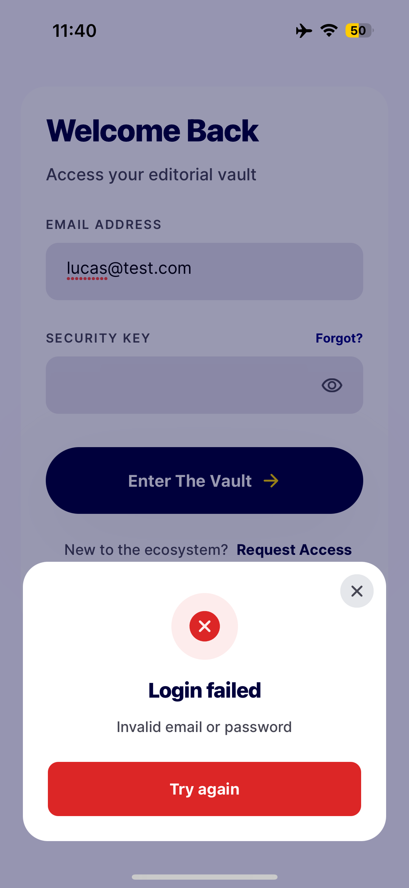
    </kbd>
  </p>
  <p align="center">Figure 7.3.1.2: Login screen - Incorrect credentials entry error modal</p>

  <p align="center">
    <kbd>
        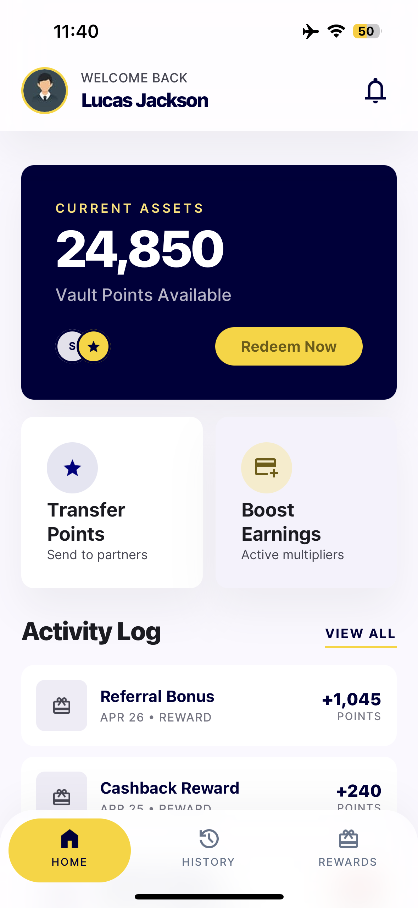
    </kbd>
  </p>
  <p align="center">Figure 7.3.1.3: Home screen - Initial state after successful login</p>

  <p align="center">
    <kbd>
        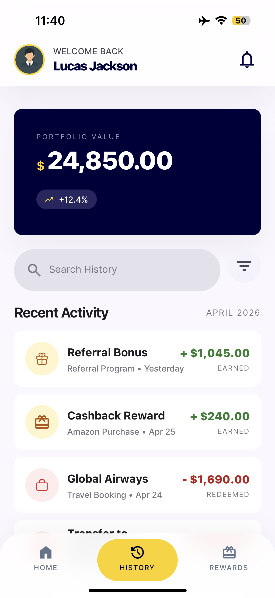
    </kbd>
  </p>
  <p align="center">Figure 7.3.1.4: History screen - Initial state</p>

  <p align="center">
    <kbd>
        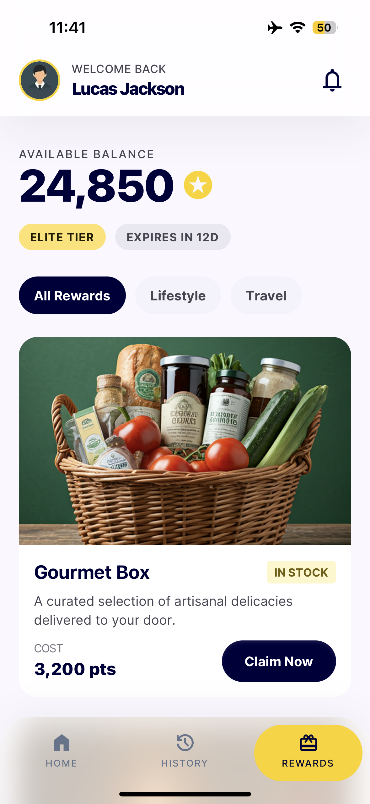
    </kbd>
  </p>
  <p align="center">Figure 7.3.1.5: Rewards screen - Initial state</p>
  
  ##### 7.3.2. Screen recording on iOS =>

  App walkthrough:

  <p align="center">
    <video src="https://github.com/user-attachments/assets/b8d9aa2c-9e35-4c22-9409-2c7e1c5cc97e" controls width="30%"></video>
  </p>

  <hr>

  ##### 7.3.3. Screenshots on Android =>
  <p align="center">
    <kbd>
        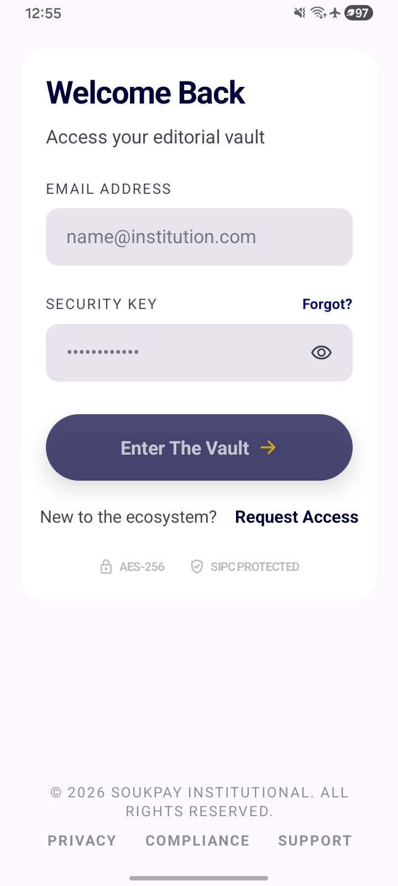
    </kbd>
  </p>
  <p align="center">Figure 7.3.3.1: Login screen - Initial state</p>

  <p align="center">
    <kbd>
        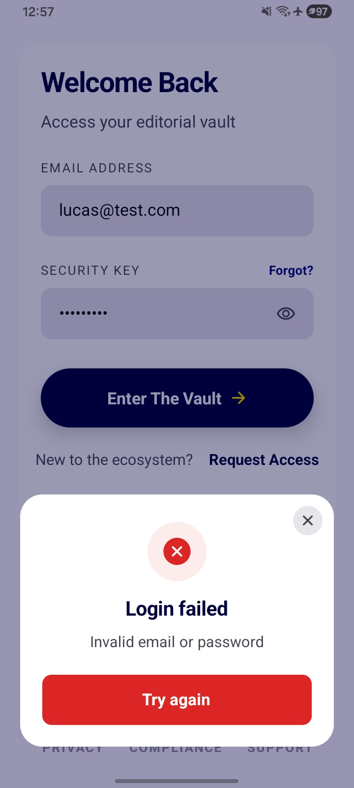
    </kbd>
  </p>
  <p align="center">Figure 7.3.3.2: Login screen - Incorrect credentials entry error modal</p>

  <p align="center">
    <kbd>
        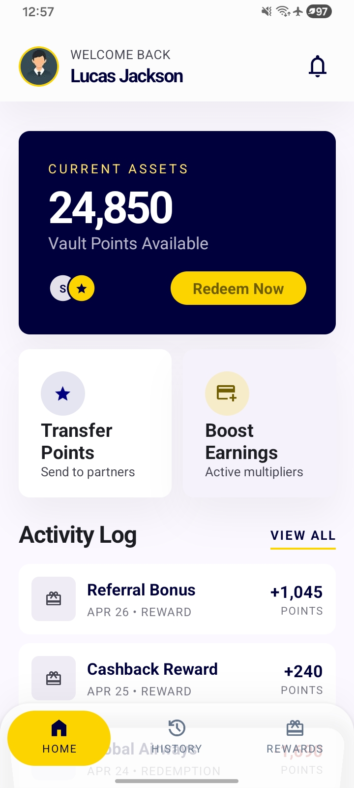
    </kbd>
  </p>
  <p align="center">Figure 7.3.3.3: Home screen - Initial state after successful login</p>

  <p align="center">
    <kbd>
        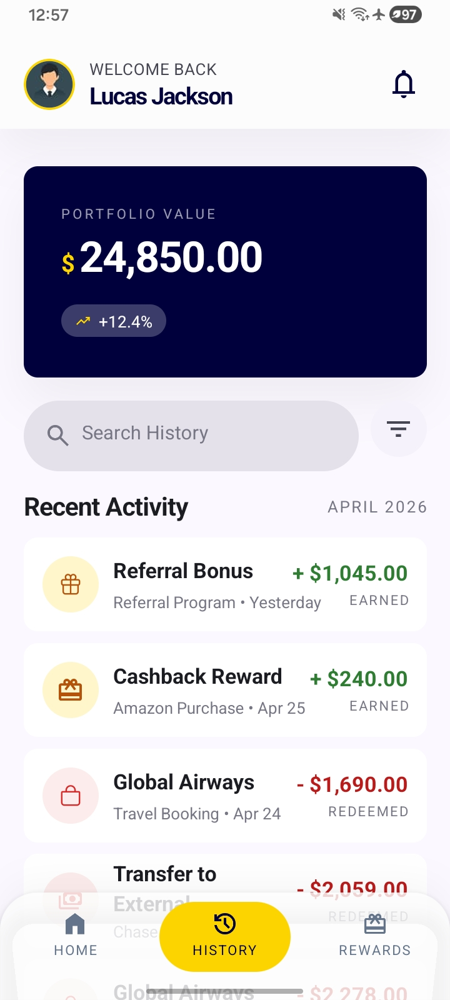
    </kbd>
  </p>
  <p align="center">Figure 7.3.3.4: History screen - Initial state</p>

  <p align="center">
    <kbd>
        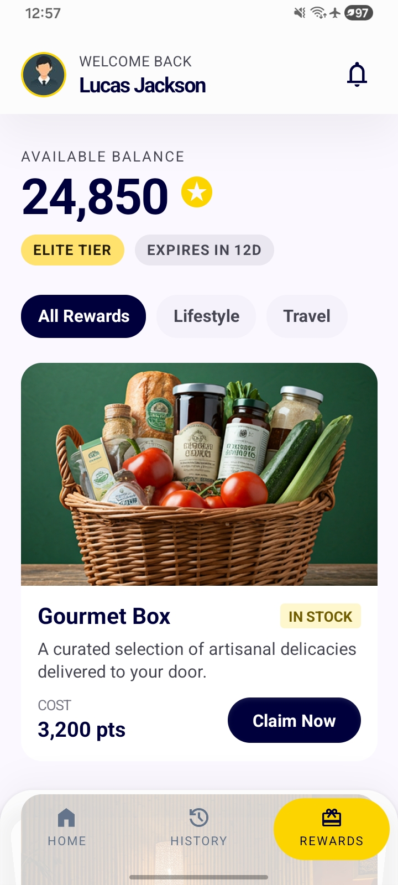
    </kbd>
  </p>
  <p align="center">Figure 7.3.3.5: Rewards screen - Initial state</p>
  
  ##### 7.3.4. Screen recording on Android =>

  App walkthrough:

  <p align="center">
    <video src="https://github.com/user-attachments/assets/ad5ec5ec-ebfb-4f07-8391-0b79322da7fc" controls width="30%"></video>
  </p>

  #### 7.4. API Documentation -

  All routes are served by the Express API.

  * **Base URL (dev)**: `http://localhost:4000`
  * **Auth**: `Authorization: Bearer <jwt>` on every endpoint except `POST /auth/login` and `GET /health`.
  * **Content type**: JSON request/response unless noted.
  * Snippets are for **Node.js 20+ / TypeScript** using the built-in `fetch`. Replace `BASE` and `token` with your own values.

  ```ts
  const BASE = 'http://localhost:4000';
  let token = ''; // set after POST /auth/login below
  ```

  ##### 7.4.1. `GET /health`
  Health check. No auth, no body. Returns `{ ok: true }`.

  ```ts
  const res = await fetch(`${BASE}/health`);
  const body = await res.json(); // { ok: true }
  ```

  ##### 7.4.2. `POST /auth/login`
  Returns signed JWT when email and password is passed. Validated with zod.

  ```ts
  const res = await fetch(`${BASE}/auth/login`, {
    method: 'POST',
    headers: { 'Content-Type': 'application/json' },
    body: JSON.stringify({ email: 'lucas@test.com', password: 'Testing2$' }),
  });
  const { token: jwt } = await res.json() as { token: string };
  token = jwt;
  ```

  Errors: `400` (wrong request input) invalid input, `401` (unauthorized) invalid email or password.

  ##### 7.4.3. `POST /auth/refresh`
  Generates a new JWT for the authenticated user. Used by the mobile app's request interceptor when the existing token is within 2 minutes of expiry.

  ```ts
  const res = await fetch(`${BASE}/auth/refresh`, {
    method: 'POST',
    headers: { Authorization: `Bearer ${token}` },
  });
  const { token: refreshed } = await res.json() as { token: string };
  ```

  ##### 7.4.4. `GET /users/me`
  Returns the current user's profile **and computed point balance** (sum of `point_ledger.delta`).

  ```ts
  const res = await fetch(`${BASE}/users/me`, {
    headers: { Authorization: `Bearer ${token}` },
  });
  const { user, balance } = await res.json() as {
    user: { id: string; email: string; name: string; pushToken: string | null; createdAt: string };
    balance: number;
  };
  ```

  ##### 7.4.5. `GET /users/me/transactions`
  Page-based ledger history, newest first. Defaults to 20 per page.

  | Query param | Default | Notes |
  |---|---|---|
  | `page` | `1` | 1-based page index |
  | `limit` | `20` | Capped at `50` |

  ```ts
  const params = new URLSearchParams({ page: '1', limit: '20' });
  const res = await fetch(`${BASE}/users/me/transactions?${params}`, {
    headers: { Authorization: `Bearer ${token}` },
  });
  const { transactions, page, limit, total, hasMore } = await res.json() as {
    transactions: Array<{
      id: string;
      delta: number;
      reason: string;
      category: 'purchase' | 'dining' | 'travel' | 'reward' | 'redemption';
      source: string | null;
      createdAt: string;
    }>;
    page: number;
    limit: number;
    total: number;
    hasMore: boolean;
  };
  ```

  ##### 7.4.6. `GET /users/me/redemptions`
  Paginated redemption history with the joined reward details.

  ```ts
  const params = new URLSearchParams({ page: '1', limit: '20' });
  const res = await fetch(`${BASE}/users/me/redemptions?${params}`, {
    headers: { Authorization: `Bearer ${token}` },
  });
  const { redemptions } = await res.json();
  // redemptions: [{ id, rewardId, pointsCost, idempotencyKey, createdAt,
  //                 reward: { id, name, description, imageUrl, category } }, ...]
  ```

  ##### 7.4.7. `POST /users/me/push-token`
  Stores (or clears, by sending `null`) the user's Expo push token. Validated with zod.
  Push token is required for send push notifications via Expo.

  ```ts
  // Register after login:
  await fetch(`${BASE}/users/me/push-token`, {
    method: 'POST',
    headers: {
      'Content-Type': 'application/json',
      Authorization: `Bearer ${token}`,
    },
    body: JSON.stringify({ pushToken: 'ExponentPushToken[xxxxxxxxxxxxxxxxx]' }),
  });

  // Clear on logout:
  await fetch(`${BASE}/users/me/push-token`, {
    method: 'POST',
    headers: {
      'Content-Type': 'application/json',
      Authorization: `Bearer ${token}`,
    },
    body: JSON.stringify({ pushToken: null }),
  });
  // returns => { ok: true }
  ```

  ##### 7.4.8. `GET /rewards`
  Lists active rewards with `stockRemaining > 0`, ordered by `pointsCost` ascending.<br>
  Optional `?category=lifestyle|travel` filter.

  ```ts
  const res = await fetch(`${BASE}/rewards?category=lifestyle`, {
    headers: { Authorization: `Bearer ${token}` },
  });
  const { rewards } = await res.json() as {
    rewards: Array<{
      id: string;
      name: string;
      description: string;
      imageUrl: string | null;
      pointsCost: number;
      stockRemaining: number;
      isActive: boolean;
      category: string;
    }>;
  };
  ```

  ##### 7.4.9. `POST /rewards/:id/redeem`
  Redeems a reward for the authenticated user.<br>
  **Requires** an `X-Idempotency-Key` header (≥ 8 chars). Replaying the same key for the same user/reward returns the original redemption instead of charging again.<br>
  After a fresh redemption, the API also fires a confirmation Expo push notification.

  ```ts
  import { randomUUID } from 'node:crypto';

  const rewardId = '<reward-id>';
  const idempotencyKey = randomUUID();

  const res = await fetch(`${BASE}/rewards/${rewardId}/redeem`, {
    method: 'POST',
    headers: {
      Authorization: `Bearer ${token}`,
      'X-Idempotency-Key': idempotencyKey,
    },
  });
  // 201 =>
  // {
  //   redemption: { id, rewardId, pointsCost, idempotencyKey, createdAt,
  //                 reward: { id, name, ... } },
  //   balance: 16350
  // }
  if (!res.ok) {
    const { error } = await res.json();
    throw new Error(`Redeem failed (${res.status}): ${error}`);
  }
  const { redemption, balance } = await res.json();
  ```

  Replaying the same key returns `200` with `alreadyExisted: true` on the server side.

  Error responses:

  | HTTP | Code | Meaning |
  |---|---|---|
  | `400` | — | `X-Idempotency-Key` missing or too short |
  | `402` | `INSUFFICIENT_POINTS` | balance < `pointsCost` |
  | `404` | `REWARD_UNAVAILABLE` | reward not found or `isActive = false` |
  | `409` | `OUT_OF_STOCK` | concurrent redemption took the last unit |
  | `409` | `IDEMPOTENCY_CONFLICT` | the key was already used by a different user/reward |

<hr>

### 8. Possible Infrastructure Improvements

1. Add rate limiting to, `POST /auth/login` with `express-rate-limit`.
2. Add Husky and lint-staged, so before committing, it can run ESLint and Prettier on the changed files.
3. Add CI pipeline like Github Actions CI, run, `npm install && npm test && npm run lint` for the API and APP directories.
4. Constants module on the API and APP projects to hold static values like, `POINTS_TO_USD`, `MIN_REFRESH_MS`, `MILESTONE_REASON`, `REFRESH_SKEW_MS`, `MIN_LOADER_MS`, in one place instead of defining them in multiple instances.
5. Validate the process.env with zod on API startup, to ensure the essential environment variables are defined, and the API refuses to start instead of crashing on the first request.
6. Add biometric unlock. After the first login, allow the user to enable faceID or fingerprint for reauthentication without the need for the password.
7. Add crash and error reporting with Sentry or Bugsnag.
8. Extend unit testing scope. Create unit tests for login success and failure, balance calculation correctness, transactions pagination and idempotency conflict.
9. Add enums to the API and APP project
10. Add data function layer to hold database operations instead of directly in the endpoint route.
11. Add refresh token rotation. Currently `auth/refresh` accepts an unexpired access token to generate another. If the token leaks, an attacker can keep refreshing it continuously. Maintain a short-lived access token and a long-lived refresh token. Verify the refresh token to allow generating a new access token. Store the access token only in the client side and the refresh token only in the database (clearing this will allow to terminate new access token generation).
12. Store user balance in DB. Currently the user's balance is calculated via, `SUM(point_ledger.delta)`. This will become slow and apply load on the API when the user reaches a large entry count like 100k. This can be eased by adding a column to the database, like, `users.balance` and keeping it up-to-date according to the ledger entries.
13. Create a Dockerfile for the API project. This will allow to startup the database and API together.

<hr>

### 9. Credits -
This project was built as a sample rewarding system with React Native and ExpressJS to showcase the skill set for SouyPay. The following was provided by SouyPay,<br>
1. Functional Requirements<br>
2. Tech stack<br>
3. High-fidelity Design<br>

The project was developed using the best practices and guidance with the use of legitimate online documentation (docs), YouTube videos and AI tools like ChatGPT and Cursor.<br>
For learning purposes, other developers' source codes were reviewed on sample applications they built and documented online.<br>
Documentation and source code in this repository was developed by H.V.L.Hasanka.
The app logo was [designed by Freepik](https://www.freepik.com/icon/surprise_18700363#fromView=resource_detail&position=3).

<hr>

### 10. License -
Copyright (c) 2026 H.V.L.Hasanka<br>
Licensed under MIT License
